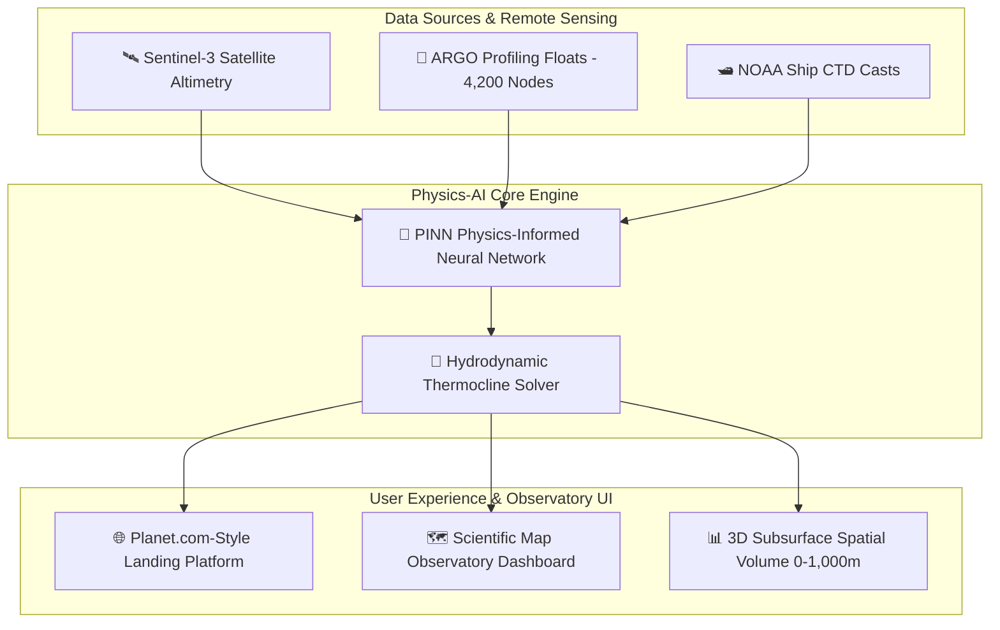

# 🌊 Ocean Embedded — Enterprise Oceanography Platform

[](https://reactjs.org/)
[](https://vitejs.dev/)
[](https://tailwindcss.com/)
[](https://threejs.org/)
[](https://maplibre.org/)
[](LICENSE)

**Ocean Embedded** is an enterprise-grade scientific Earth & Ocean observation platform inspired by **Planet Labs (`planet.com`)**. It bridges top-millimeter satellite remote sensing (SST & Altimetry) with 3D subsurface Physics-Informed Neural Networks (PINNs) and ARGO autonomous profiling float telemetry to reconstruct ocean temperature, salinity, and density fields from the surface down to **1,000 meters depth** in real time.

---

## 🏗️ System Architecture & Data Pipeline



---

## 📁 Repository Structure

```text
oceanembeded/
├── README.md                           # Root Project Documentation
├── .gitignore                          # Root Repository Ignored Files
└── frontend/                           # React 18 + Vite Frontend Project
    ├── README.md                       # Frontend Technical Documentation
    ├── index.html                      # HTML5 Entry Point
    ├── package.json                    # Dependencies & NPM Scripts
    ├── postcss.config.js               # PostCSS Configuration
    ├── tailwind.config.js              # Tailwind Design System Configuration
    ├── vite.config.js                  # Vite Dev Server & Bundler Configuration
    ├── public/
    │   └── images/
    │       ├── hero-ocean.jpg          # 8K Ocean Satellite Telemetry Visual
    │       └── banner-ocean-superres.jpg # Full-Width Coastal Satellite Banner
    └── src/
        ├── main.jsx                    # React Virtual DOM Mounting
        ├── App.jsx                     # Core Layout State & Mode Routing
        ├── index.css                   # Tailwind Base Directives & Custom Glassmorphism
        ├── components/
        │   ├── ui/                     # Planet.com Design System & Dashboard
        │   │   ├── Navbar.jsx          # Clean Header Logo & Dashboard CTA
        │   │   ├── PlanetHeroOverlay.jsx      # Interactive Ticker & Dynamic Headline
        │   │   ├── PlanetDataGridSection.jsx  # High-Res Altimetry & Recharts Cards
        │   │   ├── PlanetBannerSection.jsx    # 'Unlock a Clearer Ocean' Banner
        │   │   ├── PlanetTestimonialsSection.jsx # NOAA & Copernicus Partner Feedback
        │   │   ├── PlanetCTASection.jsx       # 'See. Decide. Act.' Call-to-Action
        │   │   ├── DashboardLayout.jsx        # Scientific Map Observatory Layout
        │   │   ├── MapLibreOceanMap.jsx       # Interactive Global Basin Map
        │   │   ├── DepthProfileChart.jsx      # Thermocline Temperature Graphs
        │   │   └── ARGOValidationModal.jsx    # Float Verification & Calibration
        │   └── three/                  # 3D WebGL Canvas Engine (R3F)
        │       ├── OceanScene.jsx      # R3F Canvas Manager & Lighting
        │       ├── OceanWater.jsx      # Cyber Sonar Wave Surface Shader
        │       ├── ResearchVessel.jsx  # Digital Twin Research Ship (R-337)
        │       ├── FleetVessels.jsx    # Autonomous ASV Drones & Sonar Pulses
        │       ├── OceanVolume3D.jsx   # 3D Subsurface Spatial Block (0-1000m)
        │       ├── SeabedTerrain.jsx   # Bathymetric Bedrock Wireframe
        │       └── UnderwaterEnvironment.jsx # Bioluminescent Particles & Rays
```

---

## ✨ Key Platform Features

- 🌐 **Planet.com-Inspired Enterprise Design**: Dark obsidian palette (`#080c14`), crisp typography, interactive live telemetry ticker bar, and 4 vantage cards (`LOOK BROADER`, `LOOK BACKWARD`, `LOOK CLOSER`, `LOOK DEEPER`).
- ⚡ **Interactive Dynamic Headline**: Auto-rotating action modes (*Act on it.* / *Dive deeper.* / *Predict futures.*) with smooth gradient glow typography.
- 🌊 **High-Resolution Data Products**: 3m Surface Altimetry, 50cm ARGO SkySat Tasking, and live subsurface temperature/salinity Recharts graphs.
- 🗺️ **MapLibre GL Map Observatory**: Global ocean basin map with ARGO float station nodes, regional selectors (North Atlantic, Equatorial Pacific, Indian Ocean), and bathymetric profile charts.
- 📊 **3D Subsurface Spatial Volume (0 - 1,000m)**: Interactive 3D subsurface thermal block built with React Three Fiber (`@react-three/fiber`).
- 🖼️ **Full-Width SuperRes Feature Banner**: *"Unlock a Clearer Ocean"* aerial satellite hero showcase.

---

## 🚀 Quick Start (Local Setup)

### Prerequisites
- **Node.js**: v18.0.0 or higher
- **npm**: v9.0.0 or higher

### Steps

1. **Clone Repository**:
   ```bash
   git clone https://github.com/Ysh2006-ai/oceanembeded.git
   cd oceanembeded/frontend
   ```

2. **Install Dependencies**:
   ```bash
   npm install
   ```

3. **Start Development Server**:
   ```bash
   npm run dev
   ```
   Open `http://localhost:3000/` in your browser.

4. **Build for Production**:
   ```bash
   npm run build
   ```

---

## 📄 License

Distributed under the MIT License. See `LICENSE` for details.
